# Build an AI powered agent for Amazon Connect using AWS QnABot

Amazon Connect, a cloud based omnichannel contact center, allows you to provide exceptional customer service by integrating with backend CRMs, APIs, and knowledge bases. To enhance the customer experience and improve self-service, you can incorporate Amazon Lex based chat bots directly into your Amazon Connect contact center. Amazon Lex allows your customers to use natural language statements to quickly identify the call reason, automate high volume and simple tasks, or get answers to their most frequently asked questions.

The AWS QnABot solution allows users to perform similar actions by enabling customers to query a knowledgebase curated through the QnA Content Designer. Using Amazon Connect&#39;s ability to invoke QnABot via Amazon Lex, customers can expand their contact center&#39;s self-service functionality by minimizing the need for customer service representatives to spend time answering frequently asked questions. Examples could be hours of operation, policy information, school schedules, or any other type of frequent questions. In order to optimize the user experience for voice via Amazon Connect, there are configurations and parameters that provide a more natural and intuitive interface.

In this post, we will walk through some options and configurations that will enable you to build a more natural conversational interface, leverage more QnABot functionalities, and use QnABot as a routing function within an Amazon Connect contact center.

## Prerequisites

To get started, you will need the following:

- An [AWS account](https://signin.aws.amazon.com/signin?redirect_uri=https%3A%2F%2Fportal.aws.amazon.com%2Fbilling%2Fsignup%2Fresume&amp;client_id=signup)
- A deployment of the [AWS QnABot](https://aws.amazon.com/blogs/machine-learning/creating-a-question-and-answer-bot-with-amazon-lex-and-amazon-alexa/) (version 4.3 or later)

## Creating and Configuring  a Connect Instance

- Log in to the QnABot Content Designer, choose the tools menu (&#9776;) and choose Connect
- Follow the step by step directions to create a contact center using QnABot to answer caller’s questions

# Enhancing QnABot within Amazon Connect

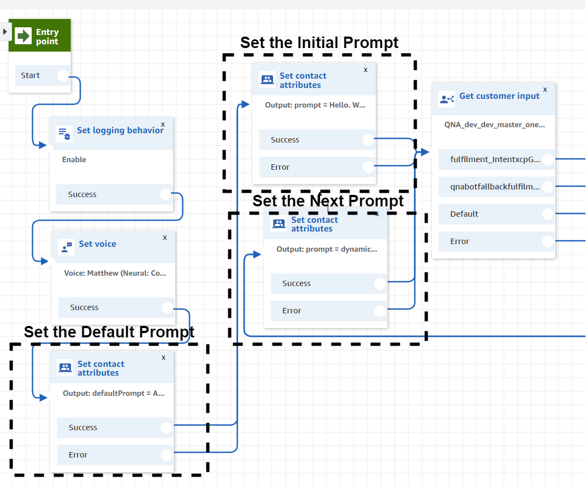

The beginning of the sample contact flow that shows setting logging behavior to true, the voice to an Amazon Polly Neural voice, and how prompts are set to played out to the user.

## Voice

The example contact flow uses Amazon Polly&#39;s Neural Text-to-Speech Voices within the QnABot workflow. These new voices deliver groundbreaking improvements in speech quality through a new machine learning approach, making automated conversations sound more lifelike by improving the pitch, inflection, intonation, and tempo.

## Prompting the User

To call an Amazon Lex chatbot from Amazon Connect, you need to provide an initial prompt in the Get Customer Input block. In the example contact flow, there are three types of prompts defined: an initial prompt, the next prompt, and a default prompt.

The initial prompt lets you greet the user for the first time. You can provide a more customized or friendly greeting to let the user know how to use the system or provide some sample questions.

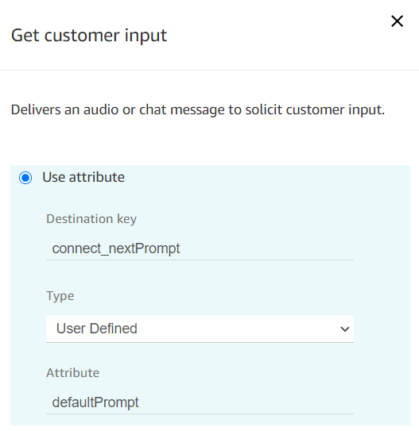

Within the QnABot invocation, pass in the defaultPrompt to ensure there is a prompt for the next invocation.

The default prompt defines what gets played out to the user if a next prompt is not explicitly set from within a QnABot response. This can be something like &quot;Ask another question, say return to main menu, or ask to speak to a representative&quot;. In this way, we can guarantee that there is always a prompt played out to the user. This default prompt is always passed into the Get Customer Input block as the next prompt in case it is not set within the question.

The next prompt feature lets you explicitly define a prompt that overwrites the default prompt through the use of QnABot Handlebars and Amazon Lex session attributes. This lets you create guardrails and recommended paths for users to follow as they traverse through the system. By default, we assign the next prompt using the connect\_nextPrompt attribute name, however this can be changed using the CONNECT\_NEXT\_PROMPT\_VARNAME option within the Settings menu for your QnABot implementation.

For example, if you have a question like &quot;When is your business open?&quot; the logical response might be &quot;We have two offices with different hours. Which location are you referring to?&quot; Without the connect\_nextPrompt construct, the user would get played the default message before being able to respond, breaking the conversational chain. In this instance, the question in QnABot could be formatted in the following way:

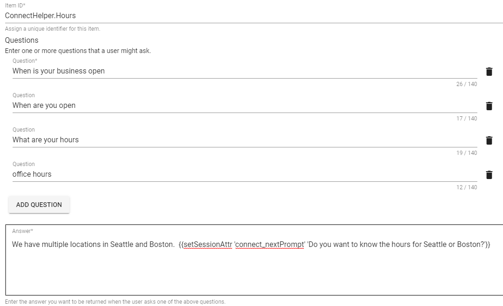

The ConnectHelper.Hours sample question shows how to set a next prompt to provide a user a recommended next step or question.

Before invoking the bot again, set the prompt to the next prompt that is returned from QnABot.

By overwriting the default prompt with the next prompt attribute, we can guide the user into being more detailed about the information they need while keeping the chain of conversation, although it requires you to have specific questions and answers to respond to the next step in the conversation.

## Barge-in

You can configure a feature called [Barge In for Amazon Lex](https://docs.aws.amazon.com/connect/latest/adminguide/get-customer-input.html#get-customer-input-bargein) within Amazon Connect. This allows users to interrupt a prompt with their response, which is useful for longer menus where users want to provide an input before the entire message plays. In the example contact flow, this feature is enabled for you by setting a session attribute in the Get customer input block.

This feature, combined with the new CONNECT\_ENABLE\_VOICE\_RESPONSE\_INTERRUPT setting in QnABot 4.3+, allows you to write longer form responses to questions that let users ask their next question without waiting. By setting this option to true, QnABot automatically passes the text after the first sentence into the connect\_nextPrompt session attribute along with the default or assigned next prompt. This forces the text to be played at the next invocation of the bot where a caller can interrupt the playback as soon as their question is answered or they have another question. This allows content designers to simplify how they write longer responses (while still enabling barge-in) without having to explicitly set the next prompt within the question. For example:

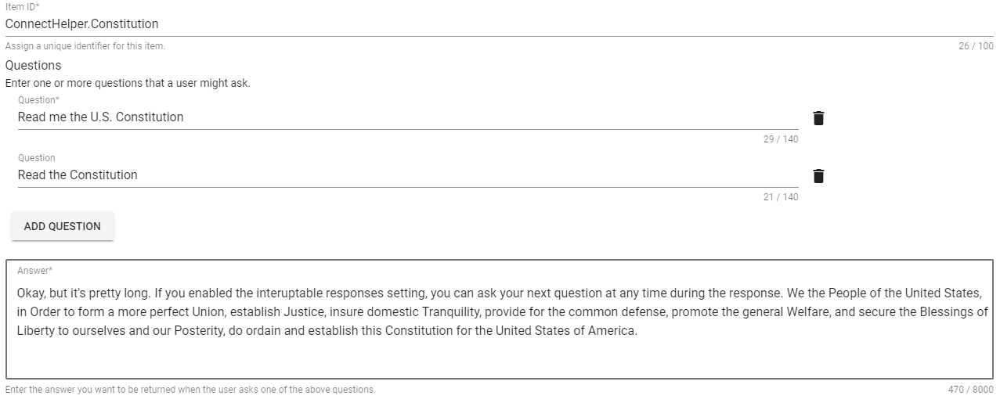

The ConnectHelper.Constitution question shows an example of a long form response that a user may want to interrupt to ask their next question.

## Using QnABot Session Attributes within Amazon Connect

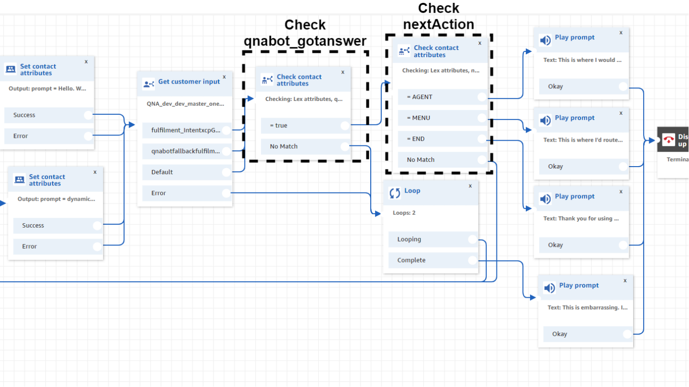

Within the sample contact flow, check for session attributes like qnabot\_gotanswer and nextAction to determine whether to route the caller to another part of the contact center or into a question not found scenario.

The handlebar construct allows you to build more complicated workflows inside of Amazon Connect -like error handling and routing to other parts of the contact center.

In version greater than 4.1, QnABot returns a parameter on every invocation called qnabot\_gotanswer, which returns whether or not a matching question was found. For versions before 4.1, you could optionally create a custom &quot;no hit&quot; question that sets the session attribute to false. This attribute combined with the built in Loop block within Connect allows you to build a workflow that can route users to agents instead of continuing to use QnABot if they experience errors or cannot find answers to their questions.

Setting attributes like &#39;nextAction&#39; let you build workflows that can route users into other parts of the contact center to speak to agents or engage in other parts of self-service. The ConnectHelper questions—ConnectHelper.Menu, ConnectHelper.Agent, and ConnectHelper.Goodbye—demonstrate how to leverage this capability. For example:

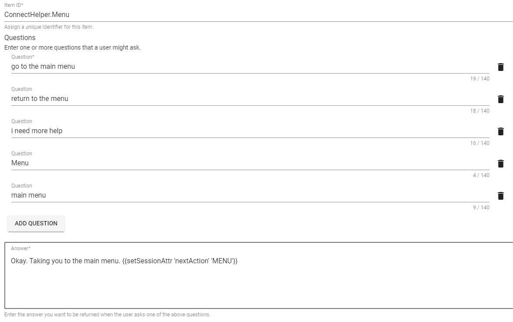

The ConnectHelper.Menu question demonstrates how to set a next action attribute within a question that can be used to route the user to another part of the contact center.

## Repeat Answer

QnABot stores the response of the previous question inside of a Lex session attribute called qnabotcontext. Using a QnABot feature called Document Chaining, you can enable a &quot;repeat&quot; type of question by passing the session attribute qnabotconnect back into the Get Customer Input block.

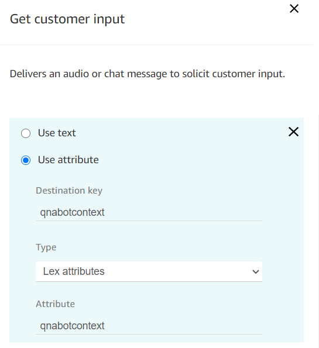

Passing in the previous qnabotcontext allows you to reference attributes stored inside the previous invocation of QnABot

The sample ConnectHelper.Repeat question demonstrates capability by pulling out the previous question&#39;s question field or returning the user to a default menu response:

The ConnectHelper.Repeat question uses a feature called Document Chaining to either repeat the answer to the previous question or route the user to the a default menu if no question has been asked.

## QnABot Topics and Navigation

Since Amazon Connect can accept Lex Session attributes from a previous invocation, you can leverage the same concepts around Topics and Navigation workflows either from the web based UI or Amazon Connect. In the example contact flow, these attributes are fed back into the &quot;Get customer input&quot; block as input attributes. Topic is a top level session attribute that is returned from the previous invocation of QnABot, so this attribute gets based directly into the next invocation. Navigation session attributes are included in the qnabotcontext attribute as of version 4.2.2 (prior to 4.2.2, these attributes were top level attributes).

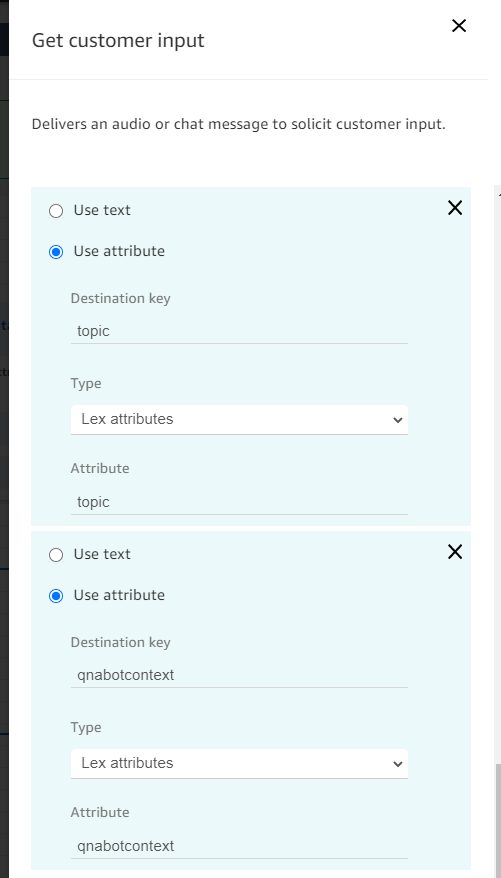

## Customizing the response by Channel

The way people expect information changes based on the channel they&#39;re using to receive that information. By passing a System Attribute within Connect that determines the end user&#39;s channel, you can create conditional statements within QnABot to modify your responses based on whether or not the user is leveraging Amazon Connect&#39;s voice channel, chat channel, or even using the default web UI.

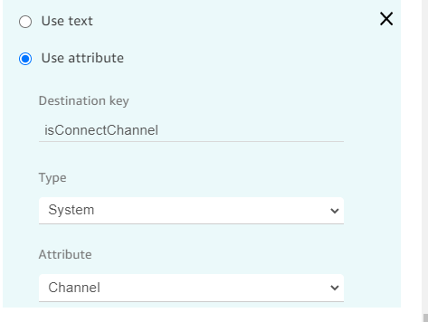

By passing in the Amazon Connect channel, you can use it to determine how to respond to the question that was asked

Within the QnABot Designer, you can craft answers that are specific to the channel invoked as part of the workflow. Over a voice channel, individuals might expect certain things like addresses or phone numbers to be played out as individual characters whereas it would look odd to have a chat message spell out phone numbers. Similarly, long URLs aren&#39;t received well over voice but are easy to include in a chat message. For example:

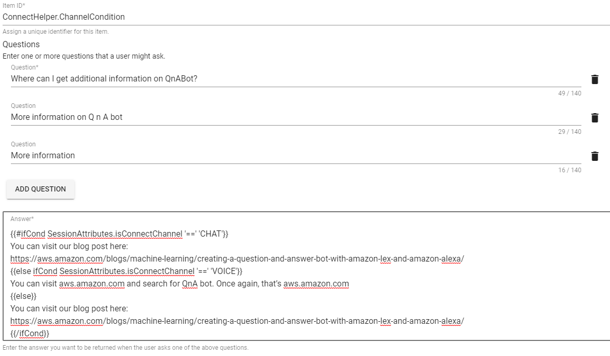

The ConnectHelper.ChannelCondition question demonstrates how to use conditional handlebars to dynamically change the output of an answer depending on the &#39;isConnectChannel&#39; session attribute.

## Reporting on Amazon Connect interactions

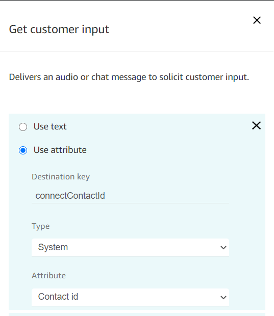

By passing in the Contact ID from Amazon Connect, you can leverage it in reporting.

QnABot records the invocation details and session attributes every time the bot is called inside of an Amazon ElasticSearch cluster that is provisioned for you when you launch the solution. This cluster includes default dashboards to monitor the performance of the bot, including questions that were asked that you didn&#39;t have answers to. By passing in the Contact ID, you can look at specific users that called the bot from Amazon Connect and view the journey they took from one question to another. This type of analysis can be useful if you&#39;re looking to understand the way your end users are interacting with the bot or if you should build additional guardrails or suggestions that would improve the experience.

## Tuning and Error Handling

Like any other AI powered system, it&#39;s important to continuously train and monitor your bot to improve customer experience. QnABot offers [tuning recommendations and monitoring capabilities](https://github.com/aws-samples/aws-ai-qna-bot/blob/master/tuning_accuracy_guide/AWS_QnABot_tuning_recognition_accuracy_guide.md) to ensure your customers are able to find the answers to their questions.

Over a voice interface, sometimes filler words can cause QnABot to transcribe an unintentional input. To accommodate for this, QnABot offers a CONNECT\_IGNORE\_WORDS setting that can be used to strip out unintentional inputs to better understand questions or provide better error handling. The setting accepts a comma delimited list for the words transcribed by filler sounds (for example e,a,uh,uhh,ah,ahh,um,umm). By monitoring the inputs to QnABot, you can build out such an exclude list to improve the performance of the bot while learning more about the questions being asked to your bot.

# Conclusion

Using session attributes, QnABot settings, and other channel specific constructs, you can improve how users engage with QnABot when using Amazon Connect. While this post is not an exhaustive list of how to improve the experience, using these parameters you can design a better customer experience that lets your users get to the information they need in an intuitive, interactive manner.

Combining Amazon Connect with QnABot allows your customer service representatives to spend time with your customers on more complex tasks while also providing users with a better experience through self-service. Customer satisfaction increases all while costs decrease since you&#39;re consuming fewer connected minutes and maximizing agent utilization.

