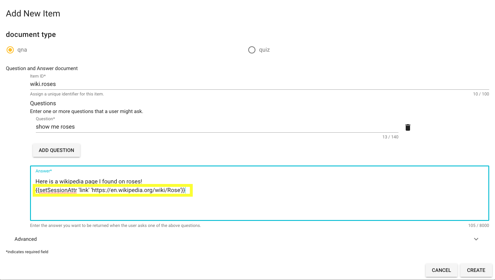
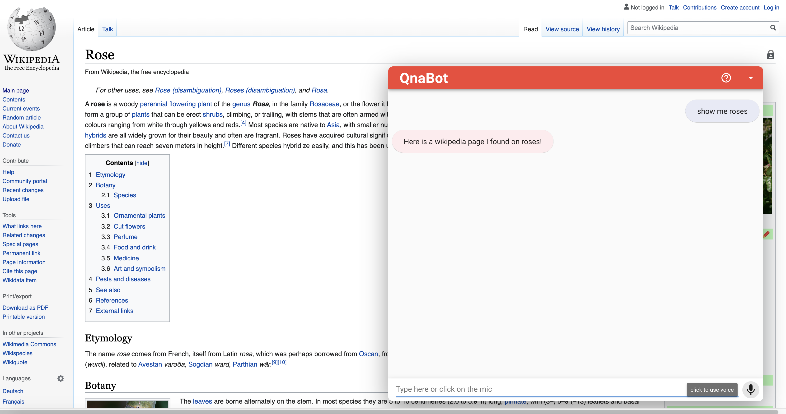

# Navigating webpages with QnaBot

The following readme demonstrates how you can navigate between webpages in your own domain, or on the internet by dynamically loading pages based on responses from QnaBot

## Getting Started

These instructions will get you a copy of the project up and running on your local machine for development and testing purposes. See deployment for notes on how to deploy the project on a live system.

### Prerequisites

1. Install [QnaBot](https://aws.amazon.com/blogs/machine-learning/creating-a-question-and-answer-bot-with-amazon-lex-and-amazon-alexa/)
2. Install [Lex-web-UI](https://github.com/aws-samples/aws-lex-web-ui)
3. Download the [iframeparent.html](https://aws-bigdata-blog.s3.amazonaws.com/artifacts/lex-web-ui-enhancementblog/enhancements/iframeparent.html) and copy it into the s3 bucket hosting the Lex-web-Ui installation.


### Configuring

In the QnaBot content designer add a new question



The snippit below is what redirects the iframe to a new domain. The following steps occur once the answer is invoked.
1. QnaBot updates the value of **link** in the sessionattributes with the relevant URL using [handlebars](https://aws.amazon.com/blogs/machine-learning/creating-a-question-and-answer-bot-with-amazon-lex-and-amazon-alexa/#handlebars)
2. The iframeparent.html fetches the new value of the **link** session attribute and populates it in the iframe src to the value specified. 
```
{{setSessionAttr 'link' 'enter desired url here'}}
```
The below page will now appear when you ask QnaBot **show me roses**

